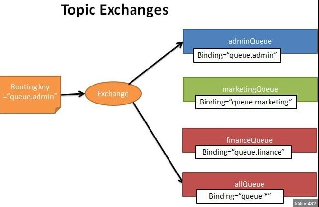
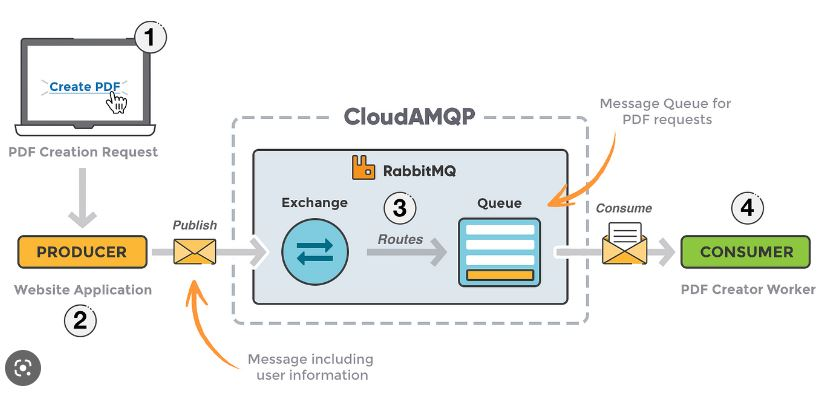
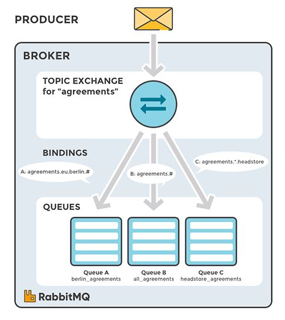

<h1> Springboot with RabbitMQ Topic Exchange Project</h1>  

<h2>Description English</h2>

This Project is to improve my knowledge using RabbitMQ, Where the Order-service is the service responsible to Send or Produce a Message
to the Services Order-History-Service and Coupon-Service basically these two Services is the Consumer or receiver.
I created the Docker-compose to Build an Image of RabbitMQ, And Topic Exchange is the most used Exchange in RabbitMQ
for this i created in this repository only this Exchange. 

 
<h2>Descrição português</h2>
Este projeto é para aprimorar meus conhecimentos usando o RabbitMQ, onde o Order-service é o serviço responsável por enviar ou produzir uma mensagem
para os Serviços Order-History-Service e Coupon-Service basicamente estes dois Serviços é o Consumidor ou destinatário.
Criei o Docker-compose para construir uma imagem do RabbitMQ, E o Topic Exchange é o Exchange mais usado no RabbitMQ
para isso criei neste repositório apenas este Exchange.

 

 
 

## Linkedin Below - Linkedin ABaixo

<h4 align="center">
   Created by   <a href="https://www.linkedin.com/in/luiz-carlos-b50693173/" target="_blank"> Luiz Carlos </a>
</h4>

</html>
